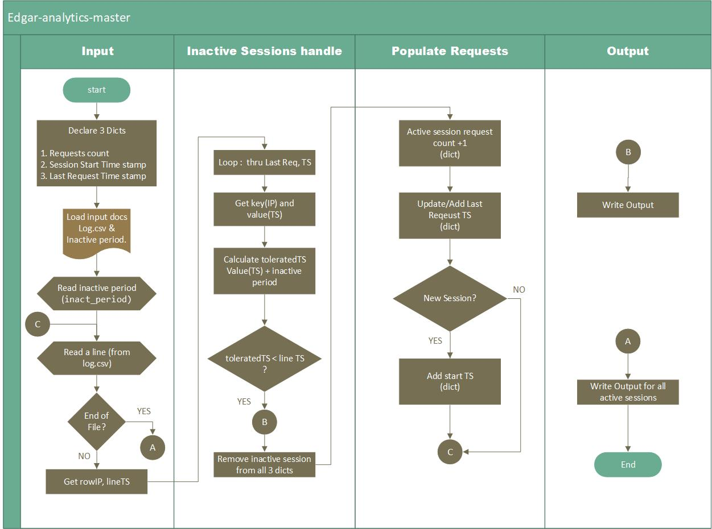

# Summary

Thank you for the assginment. I have used python script on windows env and visual studio as IDE. I did not get a chance to execute this in a linux environment. I think it should run on linux with no issues. BTW, I have not found any issues in downloading/unzipping the data. 

For this assignment data columns that are suggest to consider `ip`, `date`, `time`, `cik`, `accession`, `extention`.  However, I have not found a reason to consider `cik`, `accession`, `extention` for this task.  The task was achived with just the columns `ip`, `date`, `time`.  As per one of the FAQ response, we don't even have to be concerned with duplicate docs.  So I have not considered `cik`, `accession`, `extention` in my code.  As I have not considered these columns, I did not have to deal with any special characters.  

# Data Structures and Logic
In this assignment, I have used 3 dictionaries to handle Active sessions request count.  Looped thru Last request time stamps dictionary to identify the inactive sessions and removed them from the data structures.  As I have kept cleaning the up the data structures, the memory it took during execution never crossed 15MB.  

BTW, you will also notice a tuple I have used in my code along with other data structures. The reason why I had to use is, to keep track of all inactive sessions during the loop thru last request time stamps and then I deleted all of them after end of the loop.  The basic reason is - Dictionaries don't allow to remove elements when it is in a loop. 

Please see below for flow chart. 

# Execution Stats 

Here are some execution stats.

* CPU usage - `30%` (Consistent until end)
* Memory usage - `15MB` (Consistent until end)
* For 1 min data - execution time is `25secs`.
* For 1 hour data - execution time is `35 mins`.